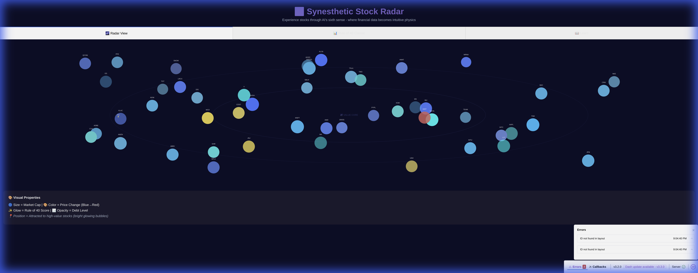
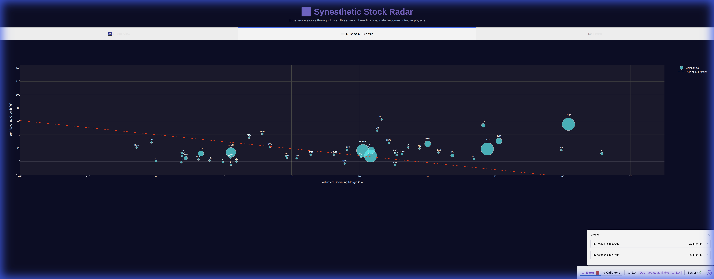
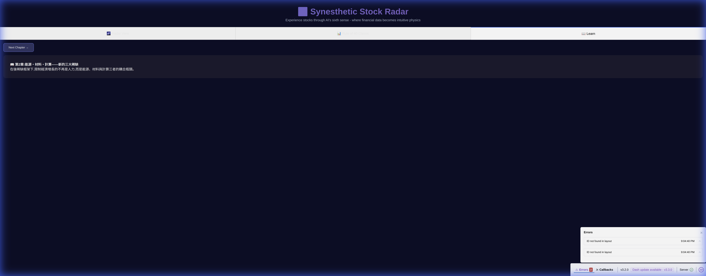
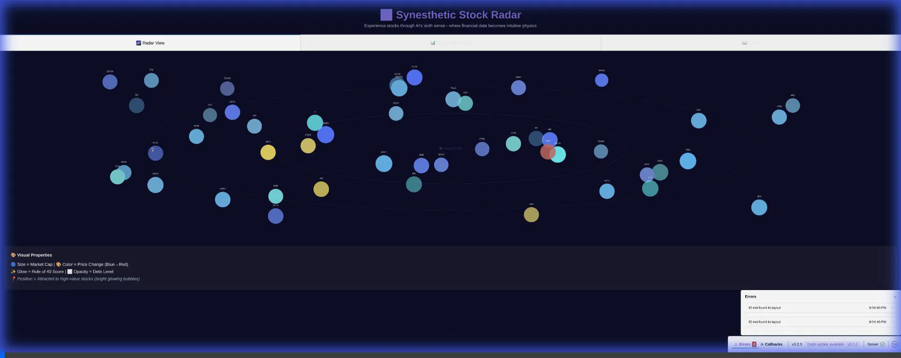

# 🌌 Synesthetic Stock Radar

**Experience stocks through AI's sixth sense** - where financial data becomes intuitive physics.

  

## 🎯 What Is This?

Traditional stock charts force you to interpret abstract numbers. **Synesthetic Stock Radar** translates high-dimensional financial data into immediate visual and physical properties you can *feel* - like giving humans a sixth sense for market dynamics.

### The Synesthetic Mappings

| Financial Metric | Physical Property | What It Means |
|-----------------|-------------------|---------------|
| 🔵 **Market Cap** | **Bubble Size** | Bigger companies = larger bubbles |
| 🎨 **Price Change** | **Color** | Blue (falling) → Red (rising) |
| ✨ **Rule of 40** | **Glow Intensity** | Brighter = better value |
| 🌫️ **Debt Level** | **Opacity** | More transparent = higher debt |
| 🚀 **Revenue Growth** | **Motion Speed** | Faster = higher growth |
| 🏀 **Volatility** | **Elasticity** | Bouncier = more volatile |

## ✨ Features

- **🌌 Radar View**: Physics-based visualization with 50+ stocks
- **📊 Rule of 40 Classic**: Traditional scatter plot (Operating Margin vs Revenue Growth)
- **📖 Educational Content**: Learn about post-scarcity economics
- **🔄 Real-time Data**: Auto-refresh every 5 minutes via Yahoo Finance API
- **🎨 Premium UI**: Dark space theme with glassmorphism effects

## 🚀 Quick Start

### Prerequisites
- Python 3.9+
- pip

### Installation

```bash
# Clone the repository
git clone https://github.com/Po-Hsuan-Huang/synesthetic-stock-radar.git
cd synesthetic-stock-radar

# Install dependencies
pip install -r requirements.txt

# Run the application
python app.py
```

Then open your browser to: **http://127.0.0.1:8050**

## 📦 Dependencies

- `dash` - Web application framework
- `plotly` - Interactive visualizations
- `yfinance` - Yahoo Finance API wrapper
- `pandas` - Data manipulation
- `numpy` - Numerical computing
- `gunicorn` - Production server

## 🎮 Usage

### Radar View
- Hover over bubbles to see detailed stock metrics
- Watch stocks naturally cluster toward high-value areas (bright glowing bubbles)
- Spot opportunities at a glance without reading numbers

### Rule of 40 Classic
- Traditional view showing Operating Margin vs Revenue Growth
- Stocks above the red line have strong fundamentals
- Bubble size represents market cap

### Learn Tab
- Cycle through educational content about post-scarcity economics
- Understand the principles behind Rule of 40

## 📸 Visual Demonstrations

### 🌌 Radar View - The Synesthetic Experience



**What you're seeing:**
- Each bubble is a stock with **size proportional to market cap**
- **Color coding**: Blue stocks are falling, yellow/orange/red are rising
- **Bright glowing bubbles** = high Rule of 40 scores (best value stocks like NVDA, AMD)
- Stocks are **attracted toward the center** (high Rule of 40 "value core")
- **Hover tooltips** show comprehensive metrics including Rule of 40 breakdown

**The "Sixth Sense" Effect:**
> You can instantly spot high-value stocks (bright, glowing bubbles in the center) without reading a single number. Risky/volatile stocks appear more translucent and drift toward edges. Growth stocks move faster. Large-cap stable stocks are big, solid, slow-moving.

### 📊 Rule of 40 Classic View



**Traditional Technical Analysis:**
- X-axis: Operating Margin (%)
- Y-axis: Revenue Growth (%)
- Red dashed line: Rule of 40 frontier (where Margin + Growth = 40)
- Bubble size: Market Cap
- Stocks above/left of the line are strong investments

### 📖 Educational Content



**Post-Scarcity Economics:**
- Chapter 1: The Dawn of Post-Scarcity Era
- Chapter 2: Energy, Materials, Computation  
- Chapter 3: Distribution, Ownership & Incentives
- Cycle through chapters using "Next Chapter" button

## 🎬 Browser Recordings

Watch the Synesthetic Stock Radar in action:



**Demo showing:**
- Tab navigation between all three views
- Hover interactions revealing detailed stock metrics
- Smooth transitions and responsive UI
- Real-time data visualization with 50+ stocks

## 🧠 The Philosophy

> "When you can't process 12+ metrics per stock instantly, you miss patterns. When those metrics become **size, color, glow, and motion**, you see the market like an AI does."

This isn't just a visualization - it's a **new sensory modality for financial data**.

## 📊 Rule of 40

The **Rule of 40** is a key metric for evaluating growth companies:

```
Rule of 40 = Operating Margin (%) + Revenue Growth (%)
```

- **Score ≥ 40**: Strong, balanced growth and profitability
- **Score < 40**: May be growing too expensively or not growing enough

In the radar, high Rule of 40 stocks appear as **bright, glowing bubbles** - they're the winners.

## 🛠️ Technical Architecture

```
synesthetic-stock-radar/
├── app.py                 # Main Dash application
├── stock_api.py          # Yahoo Finance data fetching
├── stock_physics.py      # Metric → property mappings
├── assets/
│   ├── dark_theme.css    # Original styling
│   └── radar.css         # Premium dark theme
└── requirements.txt      # Python dependencies
```

## 🎨 Visual Design

- **Space-themed background** (#0a0e27)
- **Purple gradient accents** (#667eea → #764ba2)
- **Glassmorphism UI** panels
- **Concentric zone circles** showing value clusters
- **Smooth transitions** and hover effects

## 🔮 Future Enhancements

### Phase 1: Interactive Controls
- [ ] **Filter Buttons**: Quick filters for Top Gainers, Most Traded, Best Value stocks
- [ ] **Time Speed Control**: Slow-motion to observe patterns, or fast-forward
- [ ] **Interactive Gravity**: Slider to control attraction strength toward value core
- [ ] **Zoom Levels**: Galaxy view → Sector view → Individual stock focus

### Phase 2: Advanced Physics
- [ ] **Real-time Animation**: Smooth 60 FPS physics simulation with continuous motion
- [ ] **Collision Detection**: Stocks bounce off each other based on volatility
- [ ] **Sector Clustering**: Stocks group by industry with color-coded zones
- [ ] **Orbital Mechanics**: Stocks orbit around value core based on fundamentals

### Phase 3: Gamification
- [ ] **Achievement System**:
  - 🦅 "Eagle Eye" - Discovered a hidden gem before it trended
  - 🎯 "Pattern Master" - Identified 3 forming clusters
  - 🎲 "Contrarian" - Found value in volatile stocks
  - 💎 "Gem Collector" - Tracked 10+ high Rule of 40 stocks
- [ ] **Discovery Mode**: Highlight "hidden gems" with special effects
- [ ] **Heat Map Overlay**: Show trading volume as temperature zones

### Phase 4: Advanced Features
- [ ] **Sector Analysis**: Filter and compare by industry sectors
- [ ] **Historical Playback**: Replay market movements over time
- [ ] **Portfolio Tracking**: Pin and track your portfolio stocks
- [ ] **AI Insights**: Natural language summaries of radar patterns
- [ ] **Mobile App**: Touch-friendly physics interactions for tablets
- [ ] **Collaborative Mode**: Share radar views with custom annotations

## 📝 License

MIT License - feel free to use and modify!

## 🙏 Acknowledgments

- Data provided by [Yahoo Finance](https://finance.yahoo.com/) via `yfinance`
- Built with [Dash](https://plotly.com/dash/) and [Plotly](https://plotly.com/)
- Inspired by synesthetic data visualization principles

## 🤝 Contributing

Contributions welcome! Feel free to:
- Report bugs
- Suggest new synesthetic mappings
- Improve the physics simulation
- Add new visualization modes

## 📧 Contact

Questions? Ideas? Open an issue or reach out!

---

**Made with ✨ by transforming abstract data into intuitive experiences**
